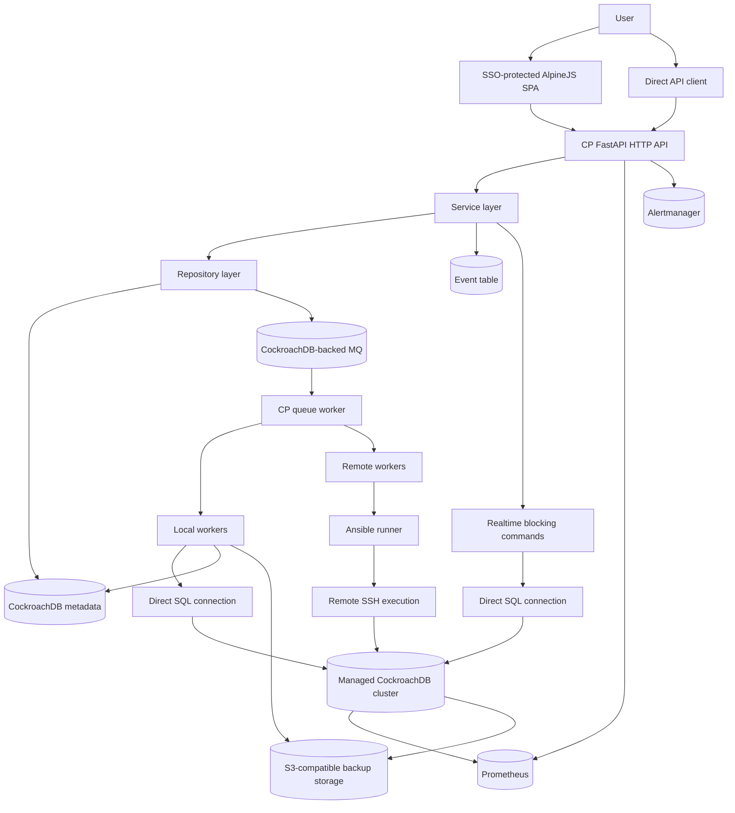

# cp

`cp` is the control plane component of a CockroachDB DBaaS platform. It provides the secure HTTP API, web application, metadata model, job framework, and operational workflows used to create, manage, monitor, back up, and restore CockroachDB clusters.

The CP backend is intentionally stateless. Durable state lives in CockroachDB, while operational integrations such as Prometheus, Alertmanager, Ansible, and S3-compatible object storage provide the surrounding DBaaS capabilities.

## Architecture

CP serves two API clients:

- The bundled SPA webapp in `webapp/`, built with AlpineJS.
- Direct API clients authenticated with API keys.

Users do not talk to workers, databases, Prometheus, Alertmanager, or managed clusters directly through CP internals. All user interaction enters through the HTTP API layer, either via the SSO-protected webapp or through API keys.

## Request Flow

The API layer can execute two kinds of commands.

Realtime commands are blocking from CP's perspective. They are used when the operation is expected to complete quickly, such as reading cluster metadata, querying backup details, listing database objects, or issuing targeted SQL operations against a cluster.

Asynchronous commands are queued through the job framework. The API creates a Job, writes a message to the MQ, and returns a job id to the caller. A queue worker later claims the message, executes the work, records task progress, and updates the Job state.

Jobs have two execution modes:

- Local workers in `cp/workers/local/` stay inside CP and use CP-managed resources such as CockroachDB SQL connections and the metadata database. Examples include object restore polling and backup catalog sync.
- Remote workers in `cp/workers/remote/` use Ansible for remote SSH execution. Examples include cluster create, delete, scale, upgrade, and health checks.

CP also schedules internal background work. These jobs are not directly initiated by an end-user action every time they run. Examples include polling CockroachDB restore job status and periodically building the backup catalog for live clusters.

## Metadata, MQ, and Audit

CP uses CockroachDB as its metadata store. The same database also powers the internal message queue used by the job framework.

Audit-worthy user actions are recorded in the Event table so changes remain traceable. Operational runtime messages and process logs are emitted through journald.

## DBaaS Integrations

CP is one component of a larger DBaaS system. The full solution also includes:

- CockroachDB for CP metadata and the MQ.
- Managed CockroachDB clusters operated by CP.
- Prometheus for cluster health metrics and the Cluster Dashboard.
- Alertmanager for the Alerts page.
- S3-compatible object storage, such as RustFS, for cluster backups.
- Ansible and SSH for remote cluster lifecycle operations.

CP configures managed clusters to take scheduled backups into the S3-compatible storage service. Because backups are produced by CockroachDB schedules, CP periodically queries the backup storage and builds a catalog of available backup paths and backup contents. That catalog powers cluster recovery workflows and backup browsing in the webapp.

## Features

- Cluster lifecycle management including create, scale, upgrade, restore, and delete workflows.
- Cluster inventory and detail views for browsing managed CockroachDB deployments.
- Job tracking and rescheduling for asynchronous operational tasks.
- Backup management including backup catalog sync, backup detail inspection, object restore, and full cluster recovery.
- Database user management including create, delete, password rotation, and role management.
- Prometheus-backed dashboards for cluster health metrics.
- Alertmanager-backed alert visibility.
- Auditing of user actions through an internal event log.
- Administrative management for settings, regions, versions, playbooks, and API keys.
