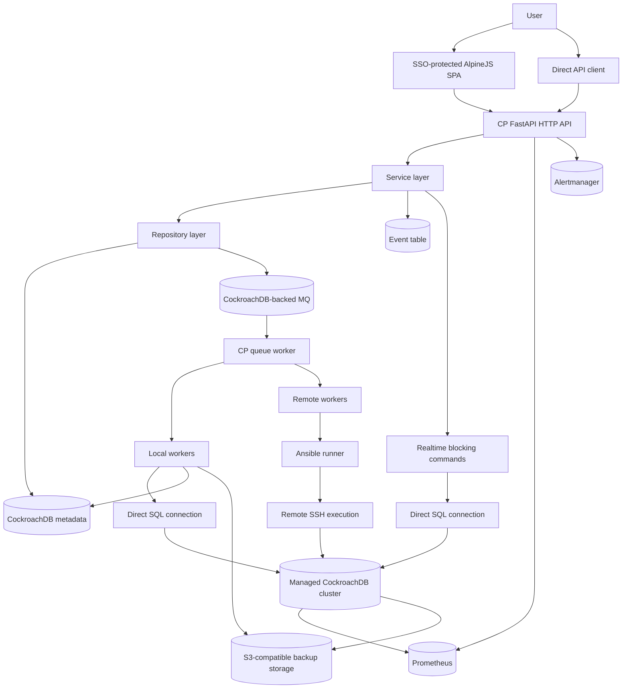

# cp

`cp` is the control plane component of a CockroachDB DBaaS platform. It provides the secure HTTP API, web application, metadata model, job framework, and operational workflows used to create, manage, monitor, back up, and restore CockroachDB clusters.

The CP backend is intentionally stateless. Durable state lives in CockroachDB, while operational integrations such as Prometheus, Alertmanager, Ansible, and S3-compatible object storage provide the surrounding DBaaS capabilities.

## Architecture

CP serves two API clients:

- The bundled SPA webapp in `webapp/`, built with AlpineJS.
- Direct API clients authenticated with API keys.

Users do not talk to workers, databases, Prometheus, Alertmanager, or managed clusters directly through CP internals. All user interaction enters through the HTTP API layer, either via the SSO-protected webapp or through API keys.

For a code-oriented navigation map, start with [`docs/CODEMAP.md`](docs/CODEMAP.md). It indexes the main layers, domains, entry points, and search patterns used by humans and coding agents.

```mermaid
flowchart TD
    User[User] --> Webapp[SSO-protected AlpineJS SPA]
    User --> ApiKey[Direct API client]

    Webapp --> API[CP FastAPI HTTP API]
    ApiKey --> API

    API --> Service[Service layer]
    Service --> Repo[Repository layer]
    Repo --> Meta[(CockroachDB metadata)]
    Repo --> MQ[(CockroachDB-backed MQ)]
    Service --> Events[(Event table)]

    Service --> Realtime[Realtime blocking commands]
    Realtime --> SQL[Direct SQL connection]
    SQL --> Cluster[(Managed CockroachDB cluster)]

    MQ --> QueueWorker[CP queue worker]
    QueueWorker --> LocalWorkers[Local workers]
    QueueWorker --> RemoteWorkers[Remote workers]

    LocalWorkers --> LocalSQL[Direct SQL connection]
    LocalSQL --> Cluster
    LocalWorkers --> Meta
    LocalWorkers --> ObjectStore[(S3-compatible backup storage)]

    RemoteWorkers --> Ansible[Ansible runner]
    Ansible --> SSH[Remote SSH execution]
    SSH --> Cluster

    API --> Prometheus[(Prometheus)]
    API --> Alertmanager[(Alertmanager)]
    Cluster --> Prometheus
    Cluster --> ObjectStore
```

## Request Flow

The API layer can execute two kinds of commands.

Realtime commands are blocking from CP's perspective. They are used when the operation is expected to complete quickly, such as reading cluster metadata, querying backup details, listing database objects, or issuing targeted SQL operations against a cluster.

Asynchronous commands are queued through the job framework. The API creates a Job, writes a message to the MQ, and returns a job id to the caller. A queue worker later claims the message, executes the work, records task progress, and updates the Job state.

Jobs have two execution modes:

- Local workers in `cp/workers/local/` stay inside CP and use CP-managed resources such as CockroachDB SQL connections and the metadata database. Examples include object restore polling and backup catalog sync.
- Remote workers in `cp/workers/remote/` use Ansible for remote SSH execution. Examples include cluster create, delete, scale, upgrade, and health checks.

CP also schedules internal background work. These jobs are not directly initiated by an end-user action every time they run. Examples include polling CockroachDB restore job status and periodically building the backup catalog for live clusters.

## Code Organization

The backend is organized in layers. The intended dependency direction is API to service to repository, with infrastructure helpers used by each layer where appropriate.

- `cp/api/` contains FastAPI routers. Route handlers should stay thin: enforce authentication and authorization dependencies, call services, and translate service errors into HTTP responses.
- `cp/services/` contains business workflows. Services validate domain input, coordinate repositories, execute managed-cluster SQL when needed, enqueue jobs, and write audit events.
- `cp/repos/` contains CP metadata persistence. Repositories should read and write CP tables only; they should not contain business decisions or connect to managed clusters.
- `cp/infra/` contains CP-specific infrastructure such as dependency factories, repository construction, and cluster connection utilities. Shared DB helpers live in `cpkit.db`.
- `cp/workers/` contains queued and background execution paths.
- `webapp/` contains the AlpineJS SPA, including UI state, hash routing, API calls, HTML templates, and CSS.
- `resources/` contains the canonical cpkit/CP schemas, seed/dev SQL, and playbook examples.

When adding a feature, prefer following the existing vertical slice:

1. Add or update models in `cp/models.py`.
2. Add framework SQL in `resources/cpkit_ddl.sql` or CP metadata SQL in `resources/ddl.sql` when persistence changes.
3. Add repository methods for metadata access.
4. Add service methods for business behavior.
5. Add API routes that delegate to the service.
6. Add or update webapp state, markup, and styles if the feature is user-facing.

## Domain Map

The current major domains are:

- Cluster lifecycle: create, delete, scale, upgrade, debug, health checks, and job tracking.
- Database access management: database objects, generated database roles, database users, direct grants, and IdP group mappings.
- Backups and recovery: backup catalog sync, backup details, object restore, and full-cluster recovery.
- Admin configuration: versions, regions, compute/disk options, settings, playbooks, API keys, and database role templates.
- Auth and authorization: OIDC/session auth, API-key auth, CP access scope, and cluster visibility.
- Events, alerts, and dashboard: audit events, Alertmanager data, and Prometheus-backed metrics.

See [`docs/CODEMAP.md`](docs/CODEMAP.md) for the file-level entry points for each domain.

## Metadata, MQ, and Audit

CP uses CockroachDB as its metadata store. The same database also powers the internal message queue used by the job framework.

Audit-worthy user actions are recorded in the Event table so changes remain traceable. Operational runtime messages and process logs are emitted through journald.

## DBaaS Integrations

CP is one component of a larger DBaaS system. The full solution also includes:

- CockroachDB for CP metadata and the MQ.
- Managed CockroachDB clusters operated by CP.
- Prometheus for cluster health metrics and the Cluster Dashboard.
- Alertmanager for the Alerts page.
- S3-compatible object storage, such as RustFS, for cluster backups.
- Ansible and SSH for remote cluster lifecycle operations.

CP configures managed clusters to take scheduled backups into the S3-compatible storage service. Because backups are produced by CockroachDB schedules, CP periodically queries the backup storage and builds a catalog of available backup paths and backup contents. That catalog powers cluster recovery workflows and backup browsing in the webapp.

## Features

- Cluster lifecycle management including create, scale, upgrade, restore, and delete workflows.
- Cluster inventory and detail views for browsing managed CockroachDB deployments.
- Job tracking and rescheduling for asynchronous operational tasks.
- Backup management including backup catalog sync, backup detail inspection, object restore, and full cluster recovery.
- Database user management including create, delete, password rotation, and role management.
- Prometheus-backed dashboards for cluster health metrics.
- Alertmanager-backed alert visibility.
- Auditing of user actions through an internal event log.
- Administrative management for settings, regions, versions, playbooks, and API keys.

## Testing

Placeholder. This section will document the project test strategy, useful commands, local dependencies, and expectations for backend, worker, and webapp changes.
